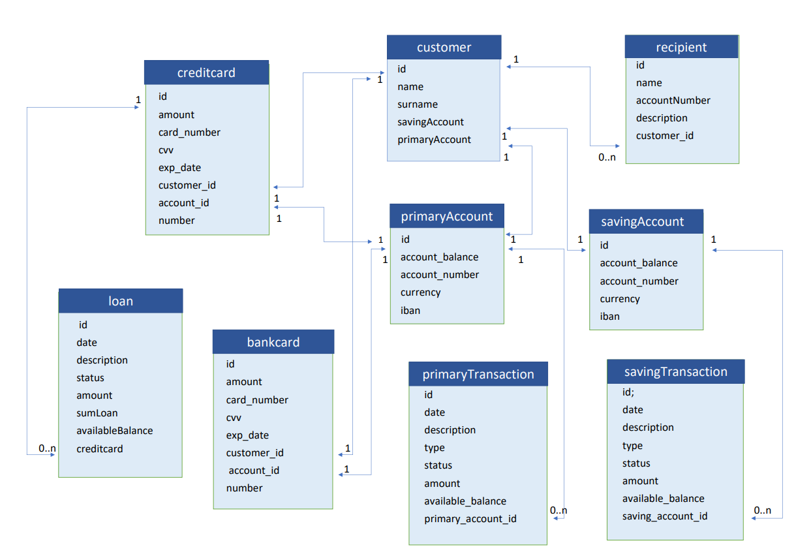

## ONLİNE BANKACILIK SİSTEMİ

Online bankacılık sistemimiz müşteri , hesap , kart ve transfer,borç ve alıcı olmak üzere 6 ana başlıktan oluşuyor. Kart , hesap  ve transfer ana başlıklarımız da kendi içlerinde banka kartı (bankcard) , kredi kartı (creditcard) ;  vadesiz mevduat hesabı (primaryAccount) ve birikim hesabı (savingAccount) ; vadesiz mevduat transferi (primaryTransfer) ve birikim transferi (savingTransaction) olarak ikiye ayrılıyorlar.

Sistemimiz şu şekilde çalışıyor:

1-Öncelikle bir müşteri oluşturuluyor.

2-Müşteri id bilgisi ile  hesap türünü belirterek ve  TL, Euro yada Dolar para birimlerinden birisini seçerek bir hesap açabilir. Bu işlem sırasında ona bir banka ve kredi kartı sunulur. Dolayısıyla isterse hesap açarken açtığı hesaba bağlı olarak bir kart  ya da daha sonra bir kart oluşturabilir.

3-Müşteri vadesiz mevduat hesabı (primaryAccount) ve birikim hesabı (savingAccount) arasında iban numaraları ve hangi hesap türünden para transfer etmek istediğini ve para miktarı belirterek  para transferi yapabilir.

4-Müşteri hesaplarından iban numarasını ve para miktarını sisteme girerek para çekme ve para yatırma işlemlerini yapabilir.

5-Müşteriye bağlı alıcılar oluşturup hesaplarından ya da kartları ile o alıcılara ödeme yapılabilir.

6-Müşteri  kart numarasını sisteme girerek kredi kartıyla harcama yapabilir. Kredi kartının extresini, borcunu yine kart numarası sisteme girerek sorgulayabilir.

7-Müşteri kredi kartı borcunu; hesabı ile iban numarası girerek ödeyebilir ya da banka kartı numarası ile ödeme yapabilir.

####                                                                       VERİTABANI ER DİYAGRAMI

